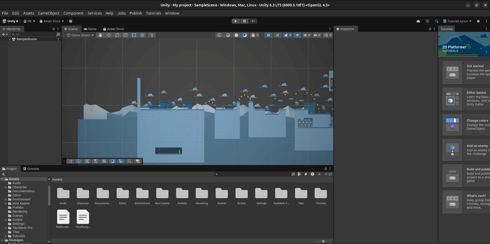
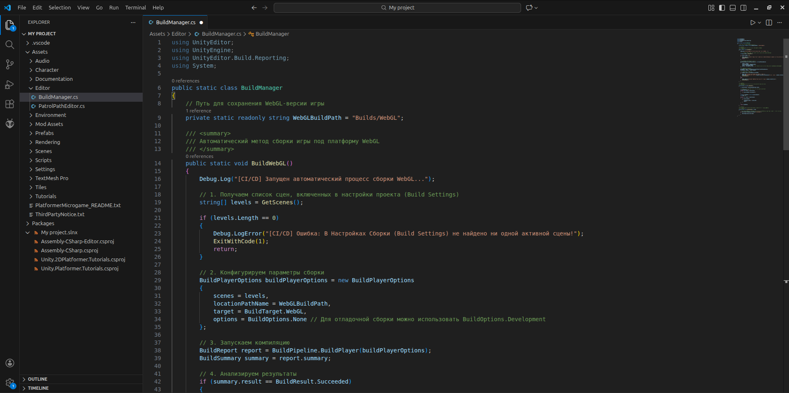
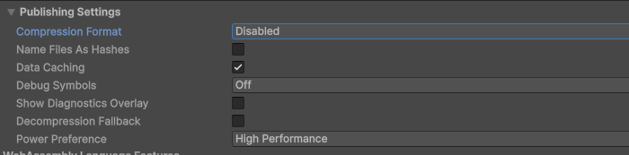
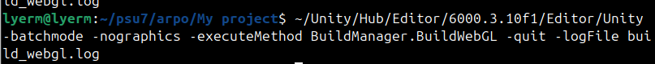
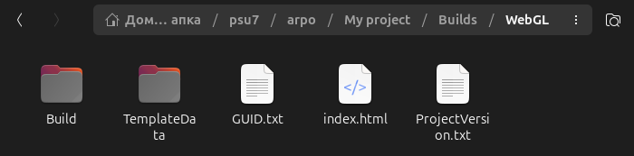
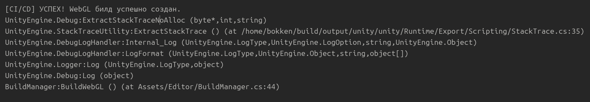
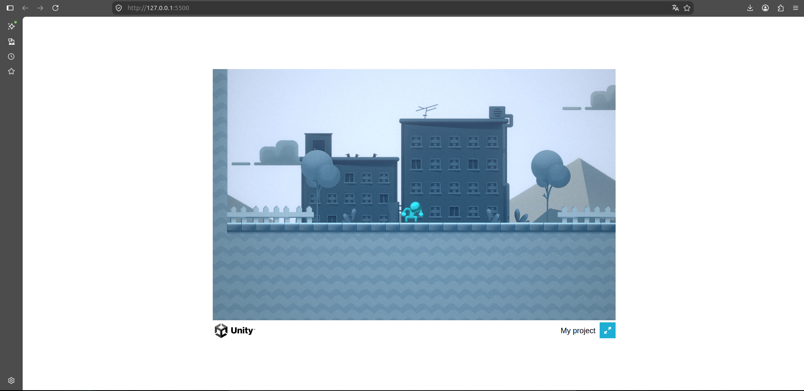
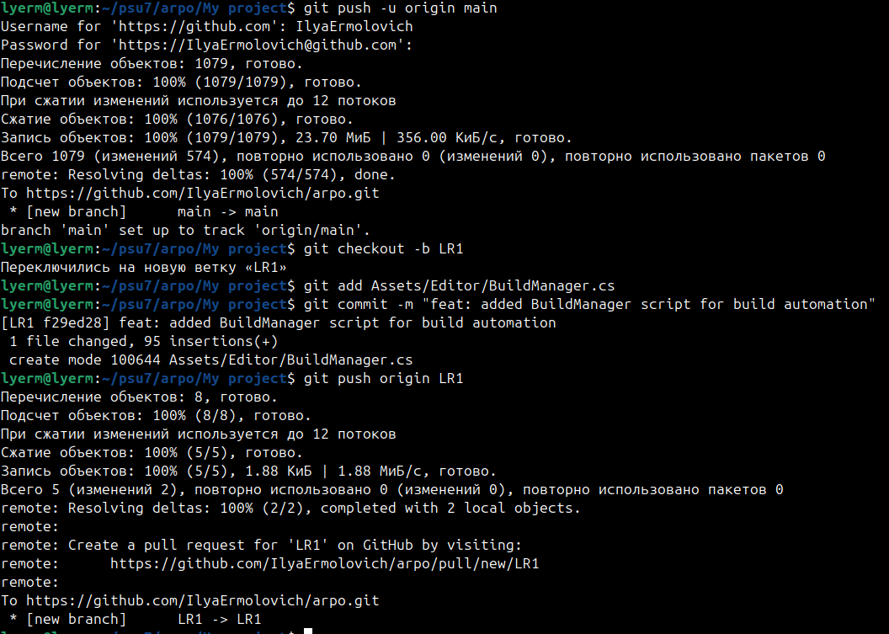

Порядок выполнения лабораторной работы

Шаг 1: Инициализация проекта

Шаг 2: Создание C# скрипта сборщика

Шаг 3: Отключение сжатия для WebGL

Шаг 4: Локальная сборка через терминал (CLI)

Шаг 5: Анализ результатов и логов сборки

Шаг 6: Проверка работоспособности (Локальный запуск)

Шаг 7: Настройка Git и публикация

