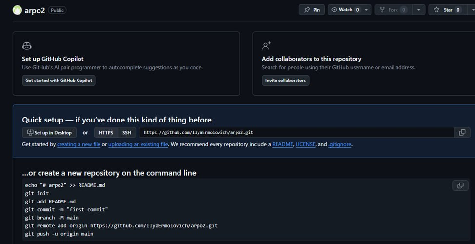
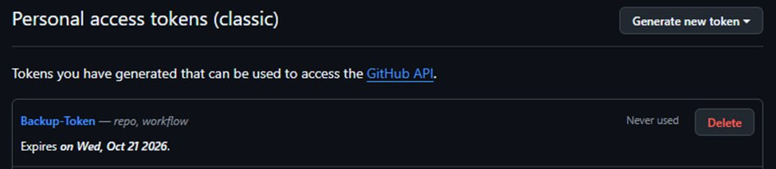
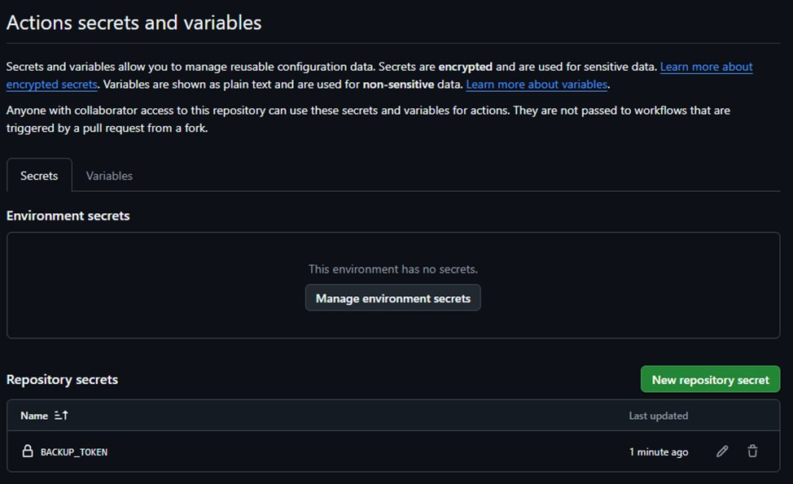
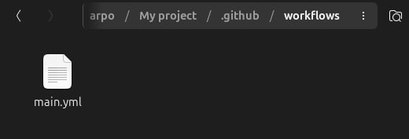
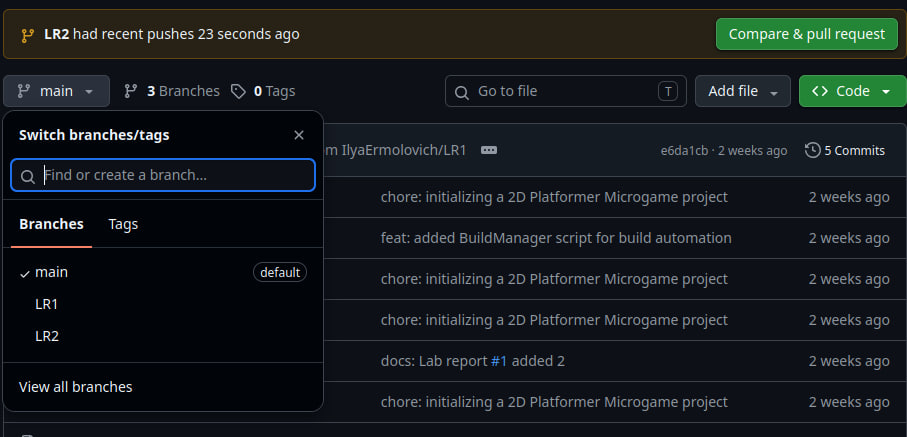
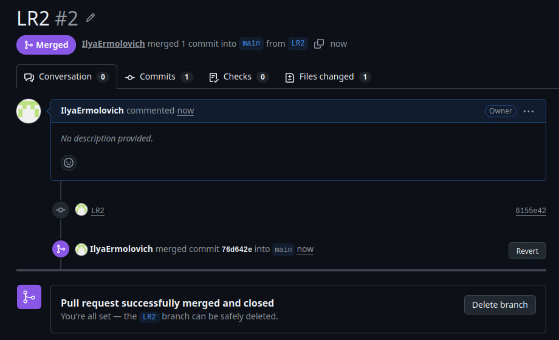
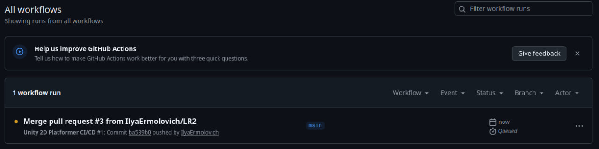
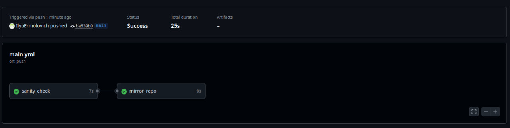
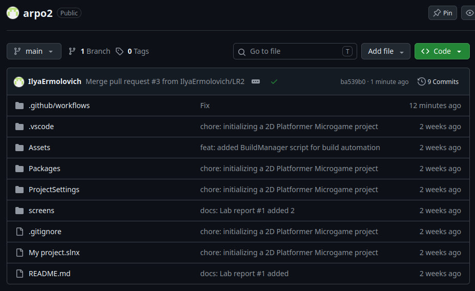

Порядок выполнения лабораторной работы 1

Шаг 1: Инициализация проекта

Шаг 2: Создание C# скрипта сборщика

Шаг 3: Отключение сжатия для WebGL

Шаг 4: Локальная сборка через терминал (CLI)

Шаг 5: Анализ результатов и логов сборки

Шаг 6: Проверка работоспособности (Локальный запуск)

Шаг 7: Настройка Git и публикация

Порядок выполнения лабораторной работы 2

Шаг 1: Создание резервного репозитория для зеркалирования

Шаг 2: Генерация токена доступа (PAT Token)

Шаг 3: Сохранение токена в секреты основного проекта

Шаг 4: Написание единого YAML пайплайна

Шаг 5: Отправка пайплайна на GitHub

Шаг 6: Проверка результатов и отчет

